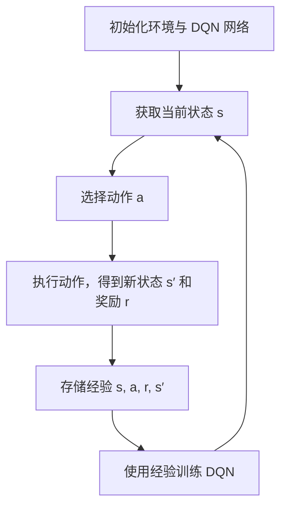

# DRLCloud# DRLCloud：基于深度强化学习的云计算资源分配平台

## 1️ 项目背景与意义

### 为什么做这个项目？

在云计算平台中，如何有效分配 CPU、内存、GPU 等资源是一项关键任务。传统的资源分配策略难以处理任务请求的动态变化。本项目旨在利用深度强化学习（DQN）自动学习资源分配策略，提升资源利用率、降低延迟。

### 实际问题是什么？

- 云资源使用率低，浪费严重
- 固定规则无法应对突发任务负载
- 无法实现实时自适应调度

---

## 2️ 相关方法与本项目分类

| 方法 | 特点 | 存在问题 |
|------|------|----------|
| 静态策略（如轮询） | 简单、实现快 | 适应性差 |
| 启发式算法（如贪心） | 易于实现 | 易陷入局部最优 |
| ✅ 强化学习（如DQN） | 可自学习、自适应 | 收敛速度慢、训练成本高 |

本项目使用的是第三类：**基于深度强化学习（DQN）的方法**

---

## 3️ 方法设计

### 方法原理

- 状态 $s$：包括各节点资源情况 + 当前任务需求
- 动作 $a$：将任务分配给某个节点
- 奖励 $r$：资源利用率越高，延迟越低，奖励越大

### 算法流程


### 关键公式
$$
Q(s_t, a_t) <- Q(s_t, a_t) + α * ( r_t + γ * max_{a'} Q(s_{t+1}, a') - Q(s_t, a_t) )
$$
- 其中：α 是学习率，γ 是折扣因子，r_t 是即时奖励

### 关键代码示例
```
import torch
import torch.nn as nn
import torch.optim as optim
import random
import numpy as np

class DQN(nn.Module):
    def __init__(self, state_dim, action_dim):
        super(DQN, self).__init__()
        self.fc1 = nn.Linear(state_dim, 128)
        self.fc2 = nn.Linear(128, 128)
        self.fc3 = nn.Linear(128, action_dim)

    def forward(self, x):
        x = torch.relu(self.fc1(x))
        x = torch.relu(self.fc2(x))
        return self.fc3(x)

class ReplayBuffer:
    def __init__(self, capacity):
        self.capacity = capacity
        self.buffer = []
        self.position = 0

    def push(self, state, action, reward, next_state, done):
        if len(self.buffer) < self.capacity:
            self.buffer.append(None)
        self.buffer[self.position] = (state, action, reward, next_state, done)
        self.position = (self.position + 1) % self.capacity

    def sample(self, batch_size):
        return random.sample(self.buffer, batch_size)

    def __len__(self):
        return len(self.buffer)

def train(dqn, target_dqn, optimizer, replay_buffer, batch_size, gamma):
    if len(replay_buffer) < batch_size:
        return
    transitions = replay_buffer.sample(batch_size)
    batch = list(zip(*transitions))
    states = torch.tensor(np.array(batch[0]), dtype=torch.float32)
    actions = torch.tensor(batch[1])
    rewards = torch.tensor(batch[2])
    next_states = torch.tensor(np.array(batch[3]), dtype=torch.float32)
    dones = torch.tensor(batch[4], dtype=torch.float32)

    q_values = dqn(states).gather(1, actions.unsqueeze(1)).squeeze(1)
    next_q_values = target_dqn(next_states).max(1)[0]
    expected_q_values = rewards + gamma * next_q_values * (1 - dones)

    loss = nn.MSELoss()(q_values, expected_q_values.detach())

    optimizer.zero_grad()
    loss.backward()
    optimizer.step()
```
## 4 软件使用说明

### 快速启动
- 克隆项目代码：
```
git clone https://github.com/你的用户名/cloud-resource-allocation.git
cd cloud-resource-allocation
pip install -r requirements.txt
```
- 启动fastapi服务器：
```
bash run.sh
```
### API接口说明

| 接口路径 | 请求方式 | 功能描述 | 请求参数 | 返回数据 |
|------|------|----------|----------|----------|
| /allocate | 	POST | 任务资源分配 | JSON格式，包含任务需求和状态 | JSON格式，分配资源信息 |
| /status | GET | 查询当前资源状态 | 无 | 适应性差 | JSON格式，当前资源使用情况 |

